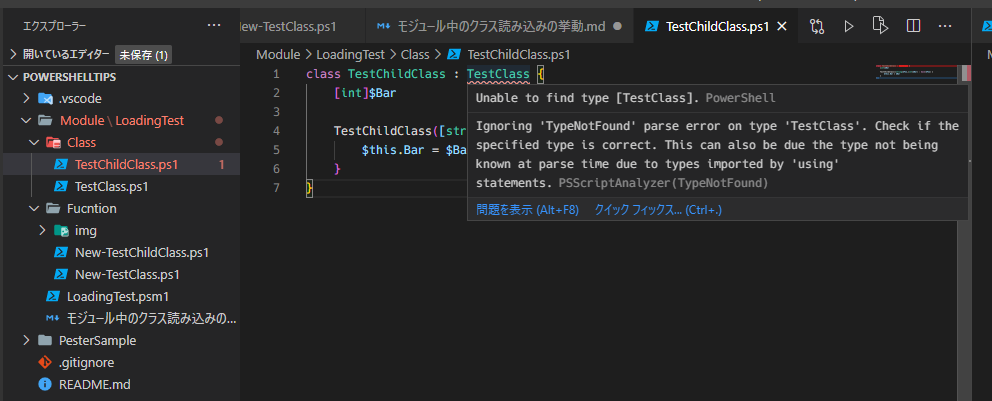

# Module読込み時のClass可視性の検証

## 検証

### 依存関係のあるFunctionの場合

以下の構成のモジュールを作成する。
1クラス1関数のシンプル構成。

```Powershell:Class
class TestClass {
    $Foo
    $Bar

    TestClass([string]$Foo){
        $this.Foo = $Foo
    }
}
```

```Powershell:Function
function New-TestClass {
    param (
        $TestInput
    )
    return [TestClass]::new($TestInput)
}
```

読み込む順番を変えてモジュールの読み込み、関数実行に影響があるか確認

```Powershell:先にClassを読み込んだ場合
. $PSScriptRoot\Class\TestClass.ps1
. $PSScriptRoot\Fucntion\New-TestClass.ps1


Export-ModuleMember New-TestClass
```

```Powershell:先にFucntionを読み込んだ場合
. $PSScriptRoot\Fucntion\New-TestClass.ps1
. $PSScriptRoot\Class\TestClass.ps1


Export-ModuleMember New-TestClass
```

```Powershell:コンソールで挙動確認
Import-Module .\Module\LoadingTest\LoadingTest.psm1
New-TestClass test
```

その結果、どちらも問題なく動作

```Powershell:両方とも問題なく動作

Foo  Bar
---  ---
test

```

理由:PowershellのFucntion、Scriptblockは実行されるまで評価されない

```Powershell

PowershellTips on  SilkyFowl/issue6 [?]
❯ function test{    
>>     dafdghrfd    
>> }                
>> 'Function Set.' 
>> 
>> test 

Function Set.
dafdghrfd: 
Line |
   2 |      dafdghrfd
     |      ~~~~~~~~~
     | The term 'dafdghrfd' is not recognized as a name of a cmdlet, function, script file, or executable program.
Check the spelling of the name, or if a path was included, verify that the path is correct and try again.

```

そのため、モジュール読み込み時に関数に問題があってもエラーが発生しない。
関数が実行されるタイミングでは依存クラスの読み込みが完了しているので問題なく動作した。

### 依存関係のあるクラスの場合

派生クラスを追加

```Powershell
class TestChildClass : TestClass {
    [int]$Bar

    TestChildClass([string]$Foo,[int]$Bar) : base($Foo) {
        $this.Bar = $Bar
    }
}
```

```Powershell
function New-TestChildClass {
    param (
        $TestInput,
        $TestInput2
    )
    return [TestChildClass]::new($TestInput,$TestInput2)
}
```

この時点でVScode上ではエラー扱いとなっている。



一旦無視してモジュール読み込んでみる

#### 基本クラスから読み込む場合

```Powershell:基本クラスから読み込む場合
. $PSScriptRoot\Fucntion\New-TestClass.ps1
. $PSScriptRoot\Fucntion\New-TestChildClass.ps1
. $PSScriptRoot\Class\TestClass.ps1
. $PSScriptRoot\Class\TestChildClass.ps1

Export-ModuleMember New-TestClass,New-TestChildClass
```

```Powershell
PowershellTips on  SilkyFowl/issue6 [?]
❯ Import-Module .\Module\LoadingTest\LoadingTest.psm1 -Force


PowershellTips on  SilkyFowl/issue6 [?]
❯ New-TestChildClass foo 123


Bar Foo
--- ---
123 foo
```

この場合は正常に動作する。


#### 派生クラスから読み込む場合

```Powershell:派生クラスから読み込む場合
. $PSScriptRoot\Fucntion\New-TestClass.ps1
. $PSScriptRoot\Fucntion\New-TestChildClass.ps1
. $PSScriptRoot\Class\TestClass.ps1
. $PSScriptRoot\Class\TestChildClass.ps1

Export-ModuleMember New-TestClass,New-TestChildClass
```

```Powershell
PowershellTips on  SilkyFowl/issue6 [?] 
❯ Import-Module .\Module\LoadingTest\LoadingTest.psm1 -Force

ParserError: C:\Users\terit\Repos\PowershellTips\Module\LoadingTest\Class\TestChildClass.ps1:1:24
Line |
   1 |  class TestChildClass : TestClass {
     |                         ~~~~~~~~~
     | Unable to find type [TestClass].
```

モジュール読み込みの段階でエラーが発生する。


### 考察

Powershellはコンソール上で動的にClassを定義出来る。
そのときは基本クラス→派生クラスの順で定義していくとエラーにならない。

```Powershell
PowershellTips on  SilkyFowl/issue6 [?] 
❯ class TestClass {
>>     $Foo
>>
>>     TestClass([string]$Foo){
>>         $this.Foo = $Foo
>>     }
>> }
   
                                     
PowershellTips on  SilkyFowl/issue6 [?] 
❯ class TestChildClass : TestClass {
>>     [int]$Bar
>>
>>     TestChildClass([string]$Foo,[int]$Bar) : base($Foo) {
>>         $this.Bar = $Bar
>>     }
>> }


PowershellTips on  SilkyFowl/issue6 [?]
❯ [TestChildClass]::new('Foo',24)


Bar Foo
--- ---
 24 Foo

```

つまり、クラス定義を行う時に基底クラスやインターフェイスのアセンブリが読み込まれているのかが大事。

## おわりに

Powershellクラス構文の複雑怪奇さはコミュニティも認識しますが問題は根深いようです......
個人的にはIssueにあったモジュール専用のクラスファイルを定義するという提案が良いと思いました。
あとInterface,Abstract,Genericとか欲しい.....

>[Fix Various PowerShell Class Issues #6652](https://github.com/PowerShell/PowerShell/issues/6652#issuecomment-444557931)
> Forgive some ignorance on my part, but looking at the number of issues and the complications that exist in classes in PowerShell today, I can't help but feel this is a design problem rather than a collection of issues/bugs to be addressed.
> 
> Wouldn't it make more sense and be much easier if:
> 
> * PowerShell had a new module type specifically for class definitions, called something like class module that could only include class definitions, with a psx1 file extension; nothing else would be allowed in these files (no functions, variables, command invocations, etc.)
> * `Import-Module` automatically recognized psx1 files defined in , or class modules included in , or  fields in a module manifest, as well as psx1 modules that don't have a manifest at all, and loaded the types defined in those psx1 files accordingly ( first, then , then , so that you can derive from other types in other modules)`RootModule``NestedModules``RequiredModules``RequiredModules``NestedModules``RootModule`
> * PowerShell automatically identified classes derived from  and added them to the current session without the extra work that is being done [here](https://www.indented.co.uk/cmdlets-without-a-dll/).`PSCmdlet`
> * PowerShell automatically exported classes that are associated with cmdlets that are exported from a module.
> * PowerShell supported  in module manifests to identify types in modules so that implicit loading could still work, even with classes.`ClassesToExport`
> * `Export-ModuleMember` had a  parameter to explicitly identify which classes you want to export`-Class`
> 
> One of the drivers behind this approach is that it would do away with the need for for modules containing classes, and supports , , , which makes installing modules from the PowerShell Gallery work as expected, and everything else that people already do with today. Having both and is confusing and already requires a lot of re-thinking when it comes to how you set up modules to properly load classes. It also facilitates defining an equivalent of binary modules from within PowerShell itself.`using``#requires``NestedModules``RequiredModules``Import-Module``using``Import-Module`
> 
> There are more thoughts behind this, but I've shared enough to see what others think for now.
